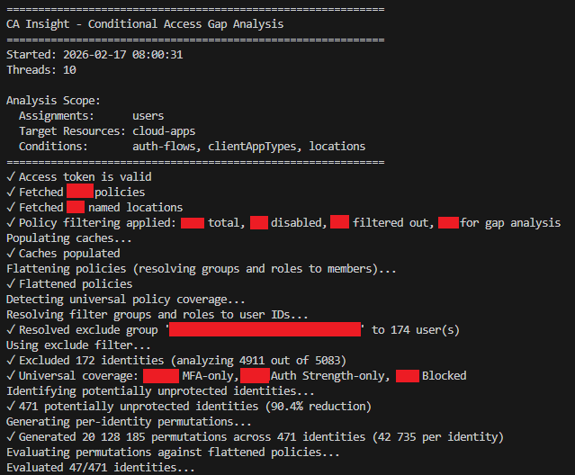
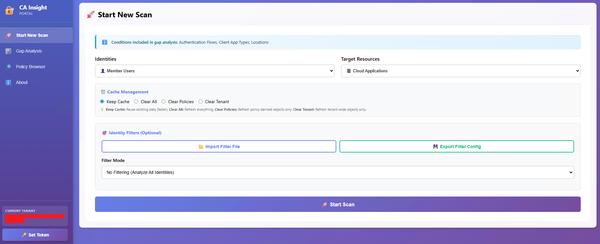
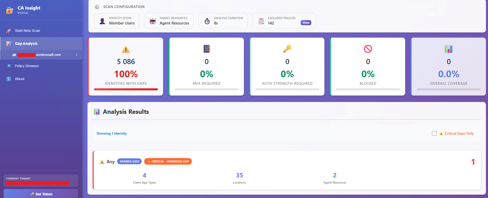
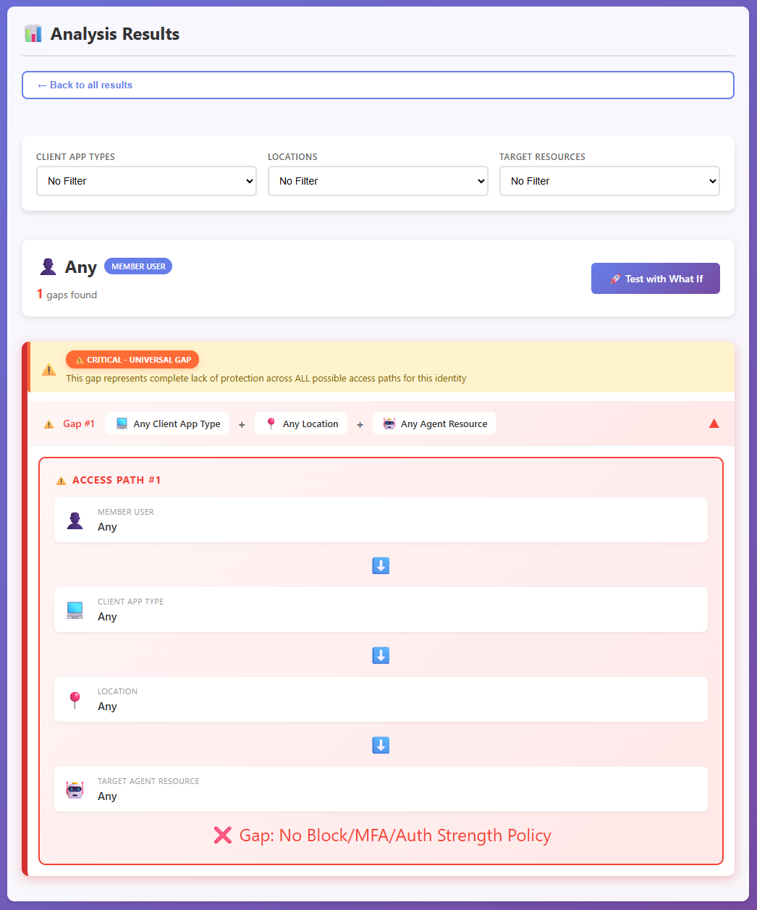
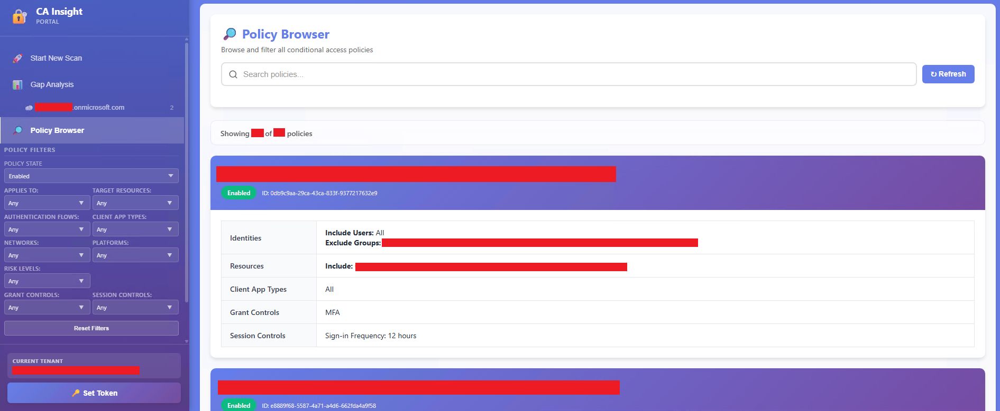

# 🧿 CA Insight 

Discover gaps in Entra Conditional Access policies before attackers do.


## 🕳️ What is a Conditional Access Gap?

A **gap** is a specific combination of access conditions (identity, application, platform, location, client type, etc.) for which **no Conditional Access policy enforces a strong control**, causing access to fall back to username and password.

CA Insight defines the following as **strong controls**:
- **Block access**
- **Grant access** with **Multi-Factor Authentication (MFA)**
- **Grant access** with **Authentication strength** (e.g. phishing-resistant MFA)

**Example Gap:**
```
User: john.doe@contoso.com
Application: Office 365
Platform: iOS
Location: Public WiFi (untrusted network)
Client Type: Browser
Auth Flow: Standard

Result: No policy requires MFA, Auth Strength or blocks access → GAP!
```

In this scenario, John can access the Office 365 application (with sensitive corporate data) from an unmanaged iOS device on public WiFi using a username and password.


## 🎯 Why CA Insight?

### 📑 Traditional approach

Traditional gap detection relies on analyzing **Entra sign-in logs** to discover successful sign ins where no conditional access policy is applied. This approach comes with 2 main disadvantages: 

1. **Purely reactive** - A gap is only discovered **after** it has already been used or exploited.
2. **Unused gaps remain unknown** - Gaps that have not been (mis)used yet do not appear in sign-in logs and remain undiscovered.

### 🧿 CA Insight's approach

Inspired by [Joosua Santasalo](https://github.com/jsa2)'s research on the now-archived [caOptics](https://github.com/jsa2/caOptics) project, **CA Insight** takes an **identity-centric** approach to enumerate **all possible access combinations**, and evaluate each of them against the tenant's Conditional Access policy configuration.

This approach comes with 2 main advantages:

1. **Purely proactive** - All gaps are discovered **before** they are used or exploited.

2. **Minimal API interaction** - Once policies and other necessary Entra objects have been retrieved from the MS Graph API, access combinations are generated and **evaluated offline**. This minimizes the amount of requests necessary for the analysis, and provides a **scalable** approach to analyze large tenants with thousands of identities.


## ✨ Key Features

- **🖥️ Dual Interface** - **CLI** for automation, CI/CD pipelines, and scripted analysis | **Web Portal** for interactive exploration, live scan monitoring, and visual gap analysis with dashboards.

- **👥 Comprehensive Identity Coverage** - Analyze **all identity types**: agent identities, guests and external users, member users, workload identities.

- **🔮 Proactive Gap Detection** - Generate and evaluate **all possible access combinations** offline before they're exploited, discovering gaps that would never appear in sign-in logs.

- **🎯 Advanced Filtering & Scoping** - Scope analysis with **identity filters** (include/exclude specific identities), **target specific resources** (agent resources, cloud apps, user actions), automatically **exclude irrelevant policies** from gap detection.

- **📊 Historical Tracking & Comparison** - Track **scan history** across multiple runs, monitor **universal coverage trends** (Auth Strength, MFA, Block), compare configurations over time, and **export results** for compliance reporting.


## 📑 Instructions

See the [project's wiki](https://github.com/emiliensocchi/entra-ca-insight/wiki) for more information about CA Insight's design, analysis workflows, installation and usage. 


## 📸 Screenshots

### CLI Interface

**Running a scan from the command line:**


### Web Portal

**Start New Scan - Running a scan from the CA Insight portal:**


**Scan History - Tracking scan history per tenant:**


**Gap Analysis - Visualizing scan details with statistics and analysis results:**


**Gap Analysis - Browsing specific gaps to visualize uncovered access paths:**


**Policy Browser - Exploring all tenant policies in one centralized view for efficient root cause analysis:**



## 📢 Disclaimer

CA Insight is **not** a Microsoft service or product. It is a personal project provided as-is for analyzing Conditional Access policy configurations, without any explicit or implicit obligations. 

CA Insight performs **read-only operations** and does not modify any policies or settings in your Entra ID tenant. Always validate findings in a non-production environment before making policy changes. The authors are **not responsible** for any misconfigurations or security issues resulting from the use of this tool.
