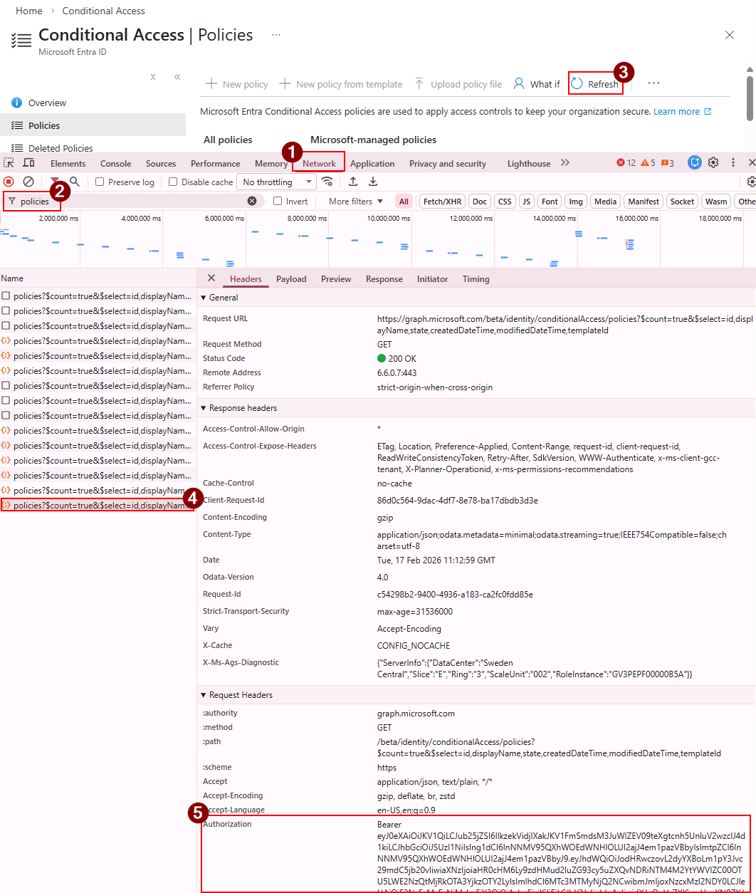

# 💻 Usage

This page summarizes **how to use** CA Insight.


## Table of Contents

- [Authentication](#authentication)
- [CLI Arguments Reference](#cli-arguments-reference)
- [CLI Usage Examples](#cli-usage-examples)
  - [Member Users](#member-users)
  - [Guests and External Users](#guests-and-external-users)
  - [Agent Identities](#agent-identities)
  - [Workload Identities](#workload-identities)
  - [Additional Options](#additional-options)
- [Filter File Format](#filter-file-format)
- [Web Interface](#-web-interface)


## Authentication

For portability, and to cover situations where registering a service principal or using device code authentication is not practical, CA Insight requires to manually provide a Microsoft Graph access token with at least the following permissions:

| Permission | Purpose |
|------------|-------|
| `Application.Read.All` | Read service principals and agent identities |
| `Group.Read.All` | Read group memberships |
| `Policy.Read.All` | Read Conditional Access policies |
| `PrivilegedAccess.Read.AzureAD` | Read PIM eligible role assignments (optional) |
| `RoleManagement.Read.All` | Read active role assignments |
| `User.Read.All` | Read user identities and profiles |

To obtain an access token, the easiest is to extract one directly from a web browser as follows:

1. **Sign in to the Entra Portal**: Navigate to the Conditional Access section of the [Microsoft Entra admin center](https://entra.microsoft.com/#view/Microsoft_AAD_ConditionalAccess/ConditionalAccessBlade/~/Policies/menuId//fromNav/Identity) and sign in with your account
2. **Open the Developer Tools**: In your browser, press `F12` or right-click and select "Inspect"
3. **Navigate to the Network Tab**: Click on the "Network" tab in Developer Tools
4. **Filter for the `/policies` API endpoint**: In the filter box, type "policies"
5. **Refresh policies**: In the Conditional Access section of the Entra Portal, click on the "↻ Refresh" button
6. **Copy the Access Token**: 
   - Find the latest request to the `/policies` endpoint
   - In the "Headers" section, find the "Authorization" header
   - Copy the token value after the `Bearer ` string



**Note**: for automated scans in CI/CD pipelines, you can use a service principal with appropriate permissions and pass the token via environment variables in a GitHub workflow or similar.


## CLI Arguments Reference

| Argument | Type | Default | Description |
|----------|------|---------|-------------|
| **Authentication** |
| `--token` | string | *required* | Microsoft Graph access token |
| **Analysis Scope** |
| `--include-assignments` | choice | *required* | Identity types: `agent-identities`, `guests`, `users`, `workload-identities` |
| `--target-resources` | choice | *required* | Resources: `agent-resources`, `cloud-apps`, `user-actions` |
| **Filtering** |
| `--filter-file` | path | `None` | Path to JSON file with identity include/exclude filters |
| `--early-termination` | integer | `100` | Stop evaluating an identity after processing a certain percentage of permutations with no gap (0-100). Example: 50 stops after 50% of an identity's permutations have been processed with no gap found |
| **Performance** |
| `--threads` | integer | `10` | Number of worker threads for parallel processing when evaluating permutations |
| **Output** |
| `--output` | string | auto-generated | Output filename prefix (without extension). Example: `my-report` generates `my-report.json` |
| **Cache Management** |
| `--clear-cache` | choice | `None` | Clear cached data: `all` (everything), `policies` (policy-specific), `tenant` (tenant-wide) |
| **Debugging** |
| `--proxy` | string | `None` | Route HTTP requests through proxy (e.g., `127.0.0.1:8080`) without certificate verification |
| `--debug` | flag | `false` | Write debug files (permutations, policy evaluation details, etc.) |


## CLI Usage Examples

### Member Users

#### Users → Agent Resources
```bash
# Find gaps when 'Users, Groups, and Roles' access 'Agent resources'
python -m caInsight --token YOUR_TOKEN --include-assignments users --target-resources agent-resources
```

#### Users → Cloud Apps
```bash
# Find gaps when 'Users, Groups, and Roles' access 'Cloud Apps'
python -m caInsight --token YOUR_TOKEN --include-assignments users --target-resources cloud-apps
```

#### Users → User Actions
```bash
# Find gaps when 'Users, Groups, and Roles' execute 'User actions'
python -m caInsight --token YOUR_TOKEN --include-assignments users --target-resources user-actions
```

### Guests and External Users

#### Guests → Agent Resources
```bash
# Find gaps when 'Guest/External users' access 'Agent resources'
python -m caInsight --token YOUR_TOKEN --include-assignments guests --target-resources agent-resources
```

#### Guests → Cloud Apps
```bash
# Find gaps when 'Guest/External users' access 'Cloud Apps'
python -m caInsight --token YOUR_TOKEN --include-assignments guests --target-resources cloud-apps
```

#### Guests → User Actions
```bash
# Find gaps when 'Guest/External users' execute 'User actions'
python -m caInsight --token YOUR_TOKEN --include-assignments guests --target-resources user-actions
```

### Agent Identities

#### Agent Identities → Cloud Apps
```bash
# Find gaps when 'Agent identities' access 'Cloud Apps'
python -m caInsight --token YOUR_TOKEN --include-assignments agent-identities --target-resources cloud-apps
```

#### Agent Identities → Agent Resources
```bash
# Find gaps when 'Agent identities' access 'Agent resources'
python -m caInsight --token YOUR_TOKEN --include-assignments agent-identities --target-resources agent-resources
```

### Workload Identities

#### Workload Identities → Cloud Apps
```bash
# Find gaps when 'Workload identities' access 'Cloud Apps'
python -m caInsight --token YOUR_TOKEN --include-assignments workload-identities --target-resources cloud-apps
```

#### Workload Identities → Agent Resources
```bash
# Find gaps when 'Workload identities' access 'Agent resources'
python -m caInsight --token YOUR_TOKEN --include-assignments workload-identities --target-resources agent-resources
```

### Additional Options

#### Early Termination
```bash
# Stop after 50% of permutations if identity is protected (faster analysis)
python -m caInsight --token YOUR_TOKEN \
                    --include-assignments users \
                    --target-resources cloud-apps \
                    --early-termination 50
```

#### Filter Files - Exclude Identities
```bash
# Use filter file to exclude emergency access accounts
# Create filter-exclude-breakglass.json:
# {
#   "include": {"users": [], "groups": [], "roles": []},
#   "exclude": {"users": ["breakglass@contoso.com"], "groups": [], "roles": []}
# }

python -m caInsight --token YOUR_TOKEN \
                    --include-assignments users \
                    --target-resources cloud-apps \
                    --filter-file filter-exclude-breakglass.json
```

#### Filter Files - Include Specific Identities
```bash
# Analyze specific teams using display names or GUIDs
# Create filter-finance.json:
# {
#   "include": {
#     "users": ["alice@contoso.com", "bob@contoso.com"],
#     "groups": ["Finance Team", "Accounting Managers"],
#     "roles": ["Global Administrator"]
#   },
#   "exclude": {"users": [], "groups": [], "roles": []}
# }

python -m caInsight --token YOUR_TOKEN \
                    --include-assignments users \
                    --target-resources cloud-apps \
                    --filter-file filter-finance.json
```

#### Custom Thread Count
```bash
# Run with 20 worker threads for faster parallel processing
python -m caInsight --token YOUR_TOKEN \
                    --include-assignments users \
                    --target-resources cloud-apps \
                    --threads 20
```

#### Custom Output Filename
```bash
# Specify custom output filename prefix (generates my_analysis.json)
python -m caInsight --token YOUR_TOKEN \
                    --include-assignments users \
                    --target-resources cloud-apps \
                    --output my_analysis
```

#### Clear Cache
```bash
# Clear all caches before running analysis
python -m caInsight --token YOUR_TOKEN \
                    --include-assignments users \
                    --target-resources cloud-apps \
                    --clear-cache all

# Clear only policy-specific caches
python -m caInsight --token YOUR_TOKEN \
                    --include-assignments users \
                    --target-resources cloud-apps \
                    --clear-cache policies

# Clear only tenant-wide caches
python -m caInsight --token YOUR_TOKEN \
                    --include-assignments users \
                    --target-resources cloud-apps \
                    --clear-cache tenant
```

#### Debug Mode with Proxy
```bash
# Run with debug output and HTTP proxy for troubleshooting
python -m caInsight --token YOUR_TOKEN \
                    --include-assignments users \
                    --target-resources cloud-apps \
                    --debug \
                    --proxy 127.0.0.1:8080
```

#### Combined Options
```bash
# Combine multiple options for comprehensive analysis
python -m caInsight --token YOUR_TOKEN \
                    --include-assignments users \
                    --target-resources cloud-apps \
                    --filter-file filter-finance.json \
                    --early-termination 75 \
                    --threads 20 \
                    --output finance-team-analysis \
                    --clear-cache all
```

## Filter File Format

CA Insight supports **filter files** to scope analysis to specific identities. Both **GUIDs** and **display names** are supported.

**Example: `filter-config.json`**
```json
{
  "include": {
    "users": [
      "ac2eb567-f4f9-42b7-b392-d8851ac0eedd",
      "john.doe@contoso.com"
    ],
    "groups": [
      "Sales Team",
      "a1b2c3d4-4e5f-6a7b-8c9d-0e1f2a3b4c5d"
    ],
    "roles": [
      "Global Administrator",
      "Application Administrator"
    ]
  },
  "exclude": {
    "users": [
      "breakglass@contoso.com"
    ],
    "groups": [
      "Service Accounts"
    ],
    "roles": []
  }
}
```

**Resolution Process:**
1. Display names are automatically resolved to GUIDs via the MS Graph API
2. Groups/roles are expanded to member user IDs
3. Final analysis includes only users passing include/exclude filters

**Use Cases:**
- **Targeted Analysis**: Analyze only Finance department users
- **Compliance Audits**: Check specific high-privilege roles
- **Exclude Test Accounts**: Remove non-production identities from reports

---

## 🌐 Web Interface

## Starting the Web Server

```bash
# Default port 5000
python web/api_server.py

# Custom port
PORT=8080 python web/api_server.py

# With debug mode
FLASK_ENV=development python web/api_server.py
```

Access the portal: **http://localhost:5000**
