# 🔀 Analysis Workflows

This page documents the **analysis workflows** executed by CA Insight for each combination of **identity type** + **target resource type**.

## Table of Contents

- [🤖 Agent Identities](#-agent-identities)
  - [Cloud Applications](#agent-identities--cloud-applications)
  - [User Actions](#agent-identities--user-actions)
  - [Agent Resources](#agent-identities--agent-resources)
- [💼 Guests and External Users](#-guests-and-external-users)
  - [Cloud Applications](#guests--cloud-applications)
  - [User Actions](#guests--user-actions)
  - [Agent Resources](#guests--agent-resources)
- [👤 Member Users (Users/Groups/Roles)](#-member-users-usersgroupsroles)
  - [Cloud Applications](#member-users--cloud-applications)
  - [User Actions](#member-users--user-actions)
  - [Agent Resources](#member-users--agent-resources)
- [🚀 Workload Identities](#-workload-identities)
  - [Cloud Applications](#workload-identities--cloud-applications)
  - [User Actions](#workload-identities--user-actions)
  - [Agent Resources](#workload-identities--agent-resources)
- [Workflow Stages Explained](#workflow-stages-explained)

---

## 🤖 Agent Identities

**Agent identities** are service principals of type `microsoft.graph.agentIdentity`. By design in Entra Conditional Access, they support only the `Block` access control and do **not** support any condition such as authentication flows, client app types or locations.

### Agent Identities → Cloud Applications

```mermaid
graph TD
    A[Start Analysis] --> B[Retrieve CA Policies]
    B --> C[Filter Policies<br/>for Agent Identities]
    C --> D[Flatten Policies<br/>Resolve Roles to Agent Identity IDs]
    D --> D1[Resolve Roles<br/>Include PIM eligible]
    D1 --> F[Build Universal<br/>Block Coverage Set]
    F --> G[Retrieve All Active <br/>Agent Identities from Entra ID]
    G --> H[Identify Potentially<br/>Unprotected Agents]
    
    H --> I{Is Any Agent NOT<br/>in universal block coverage?}
    I -->|Yes| J[Build Dimension Sets]
    I -->|No| END1[All Agents Protected]
    
    J --> K[Generate Permutations<br/>Agents × Cloud Apps]
    K --> L[Evaluate Universal<br/>Permutations First]
    
    L --> M{Universal Gap?}
    M -->|Yes| N[🔴 CRITICAL GAP]
    M -->|No| O[Evaluate Remaining Permutations]
    
    O --> P[Record Results]
    N --> P
    P --> Q[Export Results]
    Q --> R[Import to Web Portal<br/>Manual Upload]
    
    style N fill:#ff6b6b
    style END1 fill:#90ee90
    style R fill:#4ecdc4
```

---

### Agent Identities → User Actions

> [!NOTE]
> **Not Supported by Entra Conditional Access**
> 
> This combination is not possible in Entra CA by design. Agent identities (service principals) do not perform user actions like `registerSecurityInformation` or `registerOrJoinDevices`. User actions are exclusively for human identities.
---

### Agent Identities → Agent Resources

```mermaid
graph TD
    A[Start Analysis] --> B[Retrieve CA Policies]
    B --> C[Filter Policies<br/>for Agent Identities]
    C --> D[Flatten Policies<br/>Resolve Roles to Agent Identity IDs]
    D --> D1[Resolve Roles<br/>Include PIM eligible]
    D1 --> F[Build Universal<br/>Block Coverage Set]
    F --> G[Retrieve All Active <br/>Agent Identities from Entra ID]
    G --> H[Identify Potentially<br/>Unprotected Agents]
    
    H --> I{Is Any Agent NOT<br/>in universal block coverage?}
    I -->|Yes| J[Build Dimension Sets<br/>Agents × Agent Resources]
    I -->|No| END1[All Agents Protected]
    
    J --> K[Generate Permutations<br/>Agent × AllAgentIdResources]
    K --> L[Evaluate Universal<br/>Permutations First]
    
    L --> M{Universal Gap?}
    M -->|Yes| N[🔴 CRITICAL GAP]
    M -->|No| O[Evaluate Remaining Permutations]
    
    O --> P[Record Results]
    N --> P
    P --> Q[Export Results]
    Q --> R[Import to Web Portal<br/>Manual Upload]
    
    style N fill:#ff6b6b
    style END1 fill:#90ee90
    style R fill:#4ecdc4
```

---

## 💼 Guests and External Users

**Guests and external users** are human identities for which the scanned tenant is (for most of them) not their home tenant. They include local guest accounts, B2B collaboration guest users, B2B collaboration members, B2B direct connect users, and other external user types [more info](https://docs.azure.cn/en-us/entra/external-id/user-properties). By design in Entra Conditional Access, guests and external users support all types of strong controls and conditions.

### Guests → Cloud Applications

---

### Guests → User Actions

```mermaid
graph TD
    A[Start Analysis] --> B[Retrieve CA Policies<br/>from Entra ID]
    B --> C[Filter Policies<br/>for Guests and External Users]
    C --> D[Flatten Policies<br/>Resolve Groups/Roles to Guest IDs]
    D --> D1[Resolve Groups<br/>Recursive membership]
    D --> D2[Resolve Roles<br/>Include PIM eligible]
    D1 --> E[Resolve Guest Types<br/>✓ Internal Guests<br/>Other guest types execute user actions in their home tenants]
    D2 --> E
    
    E --> F[Build Universal MFA/Auth<br/>Strength Coverage Set]
    F --> G[Build Universal<br/>Block Coverage Set]
    G --> H[Retrieve All Active<br/>Guests from Entra ID]
    H --> I[Identify Potentially<br/>Unprotected Guests]
    
    I --> I1{Is Any Guest NOT in<br/>universal coverage?}
    I1 -->|Yes| J[Build Dimension Sets]
    I1 -->|No| END1[All Guests Protected<br/>No Gaps]
    
    J --> L[Generate Permutations<br/>Internal Guests × Auth flows × Client app types × Locations × User Actions]
    L --> M[Evaluate Universal<br/>Permutations First]
    
    M --> N{Universal<br/>Gap?}
    N -->|Yes| O[🔴 CRITICAL GAP]
    N -->|No| P[Evaluate Remaining<br/>Permutations]
    
    P --> Q[Record Results]
    O --> Q
    Q --> R[Export Results]
    R --> S[Import to Web Portal<br/>Manual Upload]

    style O fill:#ff6b6b
    style END1 fill:#90ee90
    style S fill:#4ecdc4
```

--- 

### Guests → Agent Resources

---

## 👤 Member Users (Users/Groups/Roles)

**Member users** are human identities for which the scanned tenant is their home tenant. These identities include individual users, security groups, Microsoft 365 groups, dynamic groups, and Entra directory roles. By design in Entra Conditional Access, member users support all types of strong controls and conditions.

### Member Users → Cloud Applications

```mermaid
graph TD
    A[Start Analysis] --> B[Retrieve CA Policies<br/>from Entra ID]
    B --> C[Filter Policies<br/>for Member Users]
    C --> D[Flatten Policies<br/>Resolve Groups/Roles to User IDs]
    D --> D1[Resolve Groups<br/>Recursive membership]
    D --> D2[Resolve Roles<br/>Include PIM eligible]
    D1 --> F[Build Universal MFA/Auth<br/>Strength Coverage Set]
    D2 --> F

    F --> G[Build Universal<br/>Block Coverage Set]
    G --> H[Retrieve All Active<br/>Users from Entra ID]
    H --> I[Identify Potentially<br/>Unprotected Users]
    I --> I1{Is Any User NOT in<br/>universal coverage?}
    I1 -->|Yes| J[Build Dimension Sets]
    I1 -->|No| END1[All Users Protected<br/>No Gaps]
    
    J --> K[Generate Permutations<br/>Users × Auth flows × Client app types × Locations × Cloud Apps]
    K --> L[Evaluate Universal<br/>Permutations First]
    
    L --> M{Universal<br/>Gap?}
    M -->|Yes| N[🔴 CRITICAL GAP]
    M -->|No| O[Evaluate Remaining<br/>Permutations]
    
    O --> P[Record Results]
    N --> P
    P --> Q[Export Results]
    Q --> R[Import to Web Portal<br/>Manual Upload]

    style N fill:#ff6b6b
    style END1 fill:#90ee90
    style R fill:#4ecdc4
```

### Member Users → User Actions

### Member Users → Agent Resources

```mermaid
graph TD
    A[Start Analysis] --> B[Retrieve CA Policies<br/>from Entra ID]
    B --> C[Filter Policies<br/>for Member Users]
    C --> D[Flatten Policies<br/>Resolve Groups/Roles to User IDs]
    D --> D1[Resolve Groups<br/>Recursive membership]
    D --> D2[Resolve Roles<br/>Include PIM eligible]
    D1 --> F[Build Universal MFA/Auth<br/>Strength Coverage Set]
    D2 --> F

    F --> G[Build Universal<br/>Block Coverage Set]
    G --> H[Retrieve All Active<br/>Users from Entra ID]
    H --> I[Identify Potentially<br/>Unprotected Users]
    I --> I1{Is Any User NOT in<br/>universal coverage?}
    I1 -->|Yes| J[Build Dimension Sets]
    I1 -->|No| END1[All Users Protected<br/>No Gaps]
    
    J --> K[Generate Permutations<br/>Users × Auth flows × Client app types × Locations × Agent Resources]
    K --> L[Evaluate Universal<br/>Permutations First]
    
    L --> M{Universal<br/>Gap?}
    M -->|Yes| N[🔴 CRITICAL GAP]
    M -->|No| O[Evaluate Remaining<br/>Permutations]
    
    O --> P[Record Results]
    N --> P
    P --> Q[Export Results]
    Q --> R[Import to Web Portal<br/>Manual Upload]

    style N fill:#ff6b6b
    style END1 fill:#90ee90
    style R fill:#4ecdc4
```

---

## 🚀 Workload Identities

**Workload identities** are single-tenant service principals registered in the scanned tenant, which are neither Managed nor Agent Identities. These represent applications, automation scripts, and service accounts that authenticate programmatically. By design in Entra Conditional Access, Workload Identities support only the `Block` access control and the **Locations** condition.

### Workload Identities → Cloud Applications

```mermaid
graph TD
    A[Start Analysis] --> B[Retrieve CA Policies]
    B --> C[Filter Policies<br/>for Workload Identities]
    C --> D[Flatten Policies<br/>Resolve Roles to Service Principal IDs]
    D --> D1[Resolve Roles<br/>Include PIM eligible]
    D1 --> F[Build Universal<br/>Block Coverage Set]
    F --> G[Retrieve All Active <br/>Workload Identities from Entra ID]
    G --> H[Identify Potentially<br/>Unprotected Workload Identities]
    
    H --> I{Is Any Workload Identity NOT in block coverage?}
    I -->|Yes| J[Build Dimension Sets<br/>Workload Identities × Locations × Cloud Apps]
    I -->|No| END1[All Workload Identities Protected]
    
    J --> K[Generate Permutations]
    K --> L[Evaluate Universal<br/>Permutations First]
    
    L --> M{Universal<br/>Gap?}
    M -->|Yes| N[🔴 CRITICAL GAP]
    M -->|No| O[Evaluate Remaining<br/>Permutations]
    
    O --> P[Record Results]
    N --> P
    P --> Q[Export Results]
    Q --> R[Import to Web Portal<br/>Manual Upload]
    
    style N fill:#ff6b6b
    style END1 fill:#90ee90
    style R fill:#4ecdc4
```

---

### Workload Identities → User Actions

> [!NOTE]
> **Not Supported by Entra Conditional Access**
> 
> This combination is not possible in Entra CA by design. Workload Identities do not perform user actions like `registerSecurityInformation` or `registerOrJoinDevices`. User actions are exclusively for human identities (member users and guests).
---

### Workload Identities → Agent Resources

```mermaid
graph TD
    A[Start Analysis] --> B[Retrieve CA Policies]
    B --> C[Filter Policies<br/>for Workload Identities]
    C --> D[Flatten Policies<br/>Resolve Roles to Service Principal IDs]
    D --> D1[Resolve Roles<br/>Include PIM eligible]
    D1 --> F[Build Universal<br/>Block Coverage Set]
    F --> G[Retrieve All Active <br/>Workload Identities from Entra ID]
    G --> H[Identify Potentially<br/>Unprotected Workload Identities]
    
    H --> I{Is Any Workload Identity NOT in block coverage?}
    I -->|Yes| J[Build Dimension Sets<br/>Workload Identities × Locations × Agent Resources]
    I -->|No| END1[All Workload Identities Protected]
    
    J --> K[Generate Permutations<br/>Workload × Location × AllAgentIdResources]
    K --> L[Evaluate Universal<br/>Permutations First]
    
    L --> M{Universal<br/>Gap?}
    M -->|Yes| N[🔴 CRITICAL GAP]
    M -->|No| O[Evaluate Remaining<br/>Permutations]
    
    O --> P[Record Results]
    N --> P
    P --> Q[Export Results]
    Q --> R[Import to Web Portal<br/>Manual Upload]
    
    style N fill:#ff6b6b
    style END1 fill:#90ee90
    style R fill:#4ecdc4
```

---

## Workflow Stages Explained

| Stage | Description | Key Outputs |
|-------|-------------|-------------|
| **1. Policy Retrieval** | Fetch all CA policies from Microsoft Graph API (enabled, disabled, report-only) | Raw policy JSON cached locally |
| **2. Policy Filtering** | Remove policies out of scope based on `--include-assignments` and `--target-resources` | Filtered policy set for analysis |
| **3. Policy Flattening** | Resolve all groups/roles to member identity IDs; cache flattened policies | `flat_policies-users.json`, `flat_policies-guests.json`, etc. |
| **3a. Guest Type Resolution** | **(Guests only)** Resolve guest types - Resolvable: Internal Guest, B2B Collab Guest/Member; Non-resolvable: B2B Direct Connect, Other External, Service Provider | Internal guest IDs for user actions filtering |
| **4. Universal Coverage Detection** | Identify identities covered by universal policies (e.g. require Auth Strength/MFA/block for all cloud apps) | Protected identity set (excluded from testing) |
| **5. Potentially Unprotected Set** | Identities NOT in universal coverage become candidates for permutation testing | Target identity list for gap analysis |
| **5a. User Actions Guest Filter** | **(Guests + User Actions only)** Filter to internal guests only (other guest types execute user actions against their home tenant) | Reduced guest identity set for user actions analysis |
| **6. Dimension Set Building** | Extract dimension values (auth flows, clients, locations, target resources) | Permutation input sets |
| **7. Permutation Generation** | Cartesian product of dimensions for each identity (users/guests: auth flows × client app types x locations × target resources; workload identities: locations × target resources; agents: target resources) | Full permutation set per identity |
| **8. Universal Permutation Test** | Evaluate universal permutation first (e.g., `identity:X → client:all → auth:none → location:all → app:all`) | Critical gap detection (highest priority) |
| **9. Targeted Permutation Test** | Evaluate remaining specific permutations (e.g., `browser + Office365 + untrusted location`) | Specific gap detection |
| **10. Early Termination** (optional) | Stop after XX% of permutations if no gaps found (sample-based analysis) | Faster results for large tenants |
| **11. Result Aggregation** | Collect all gaps, categorize by identity, calculate statistics | Gap report with metadata |
| **12. JSON Export** | Generate standalone JSON report file | Portable analysis results |
| **13. Import to Web Portal Manual Upload** | Manual upload of JSON report to web interface for visualization | Interactive gap explorer |
